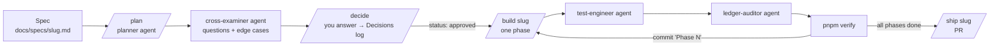

# AI development workflow

Hamood Stock is built with Claude Code using a fixed loop. Each feature goes through
**plan → cross-question → decide → build → test → audit → verify → ship**. Every step leaves a written
record in the repo, so nothing important depends on chat history.



## Commands

| Command | What it does | Writes code? |
|---|---|---|
| `/plan <spec file or text> [slug]` | Saves the spec, the **planner** writes `docs/plans/<slug>.md`, the **cross-examiner** adds questions, and Claude asks you the blocking ones | no |
| `/decide <slug> <answers>` | Records your answers in the plan's Decisions log; the plan becomes `approved` once no blocking question is open | no |
| `/build <slug> [phase]` | Implements one phase: code → tests → audit → `pnpm verify` → ticks the plan → commits `Phase N` | yes |
| `/verify` | Runs lint, typecheck, unit and integration tests, rule checker and build, then reports a table | no |
| `/audit [base]` | **ledger-auditor** reviews the branch against the business rules | no |
| `/screens [routes]` | Screenshots at 375px and desktop, EN and AR; the **ui-verifier** reports layout and RTL problems | no |
| `/ship <slug>` | Opens the PR: summary per phase, screenshots, tests, decisions to review | no |
| `/status` | Shows each plan's status, phase progress and the next step | no |

## Agents (`.claude/agents/`)

| Agent | Role | Can edit? |
|---|---|---|
| `planner` | Spec → phased plan with tasks, permissions, tests and translations | plan file only |
| `cross-examiner` | Finds ambiguities, rule conflicts and edge cases; gives a recommended answer for each | read-only |
| `implementer` | Implements one phase following CLAUDE.md | yes |
| `test-engineer` | Unit and PostgreSQL integration tests; tries to break the ledger | tests |
| `ledger-auditor` | Reviews diffs for ledger, permission, cost-leak, i18n and migration problems | read-only |
| `ui-verifier` | Screenshots and visual review (375px and desktop, EN and AR) | read-only |

## Automatic guards (`.claude/settings.json`)

- **Before an edit**, `guard-edit.sh` blocks edits to committed migrations and to the generated Prisma client.
- **After an edit**, `check-edited.sh` runs the rule checker and ESLint on the changed file. Problems go straight back to Claude.
- **Before Claude stops**, `on-stop.sh` runs typecheck, tests and the rule checker if code changed. If they fail, Claude keeps working (at most once per stop, so it can't loop).

## The rule checker (`pnpm check:rules`)

`scripts/check-rules.mjs` enforces the CLAUDE.md rules that ESLint can't express:

| Rule | Severity |
|---|---|
| `stocklevel-write`: StockLevel written outside `src/server/stock/` | error |
| `ledger-mutation`: entries or lines updated outside the service | error |
| `hard-delete`: entries, lines, products, users or warehouses deleted | error |
| `action-auth`: a server action that doesn't call the auth DAL | error |
| `route-auth`: a route handler that doesn't call the auth DAL | error |
| `migration-edit`: a committed migration was modified | error |
| `hardcoded-text`: JSX text not going through next-intl | warning |

You can make a justified exception with `// rules-allow: <rule> — <reason>` on the line or the line above it. The auditor reviews every exception.

## Tests

- `pnpm test:unit` runs pure logic, the translation key check, the rule checker and the workflow config. It needs no database.
- `pnpm test:integration` runs against `<db>_test`, which is created and migrated automatically.
- `pnpm test` runs both. `pnpm verify` runs everything, including the production build.

## Files

```
docs/specs/<slug>.md      the request, verbatim
docs/plans/<slug>.md      plan, questions, decisions, verification log (from _template.md)
docs/screenshots/         output of pnpm screenshots
.claude/agents/           the six agents
.claude/skills/           the slash commands
.claude/hooks/            guard, edit check, stop check
scripts/check-rules.mjs   rule checker
```
